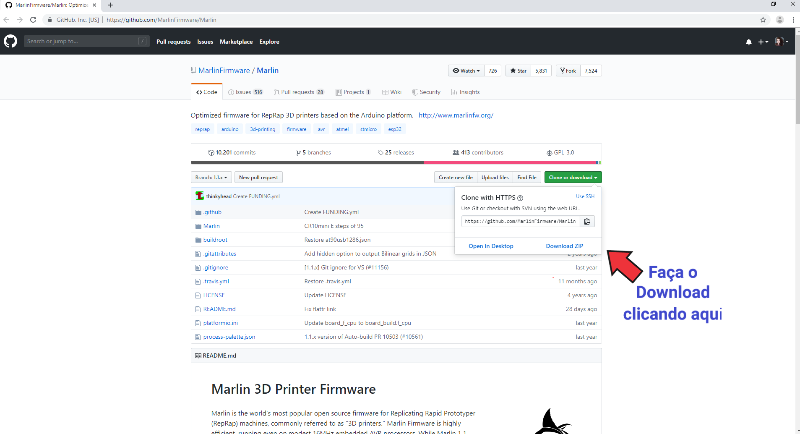
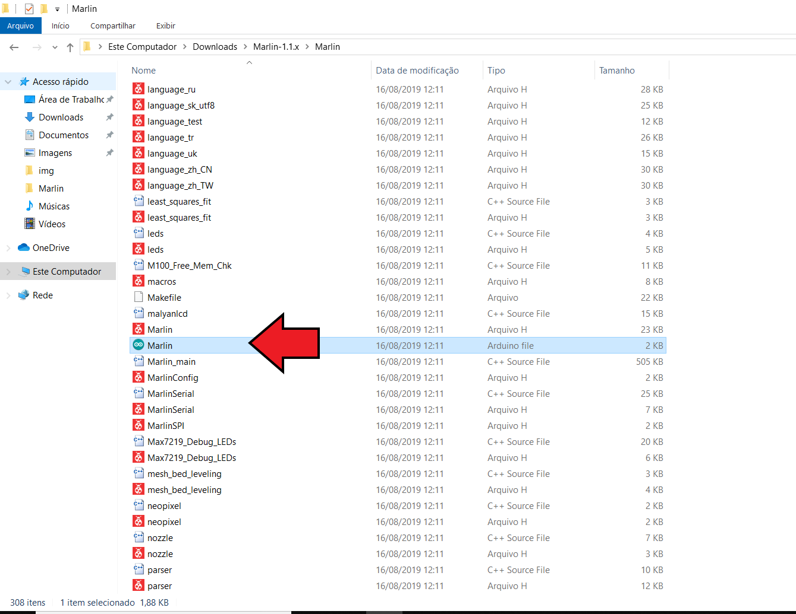
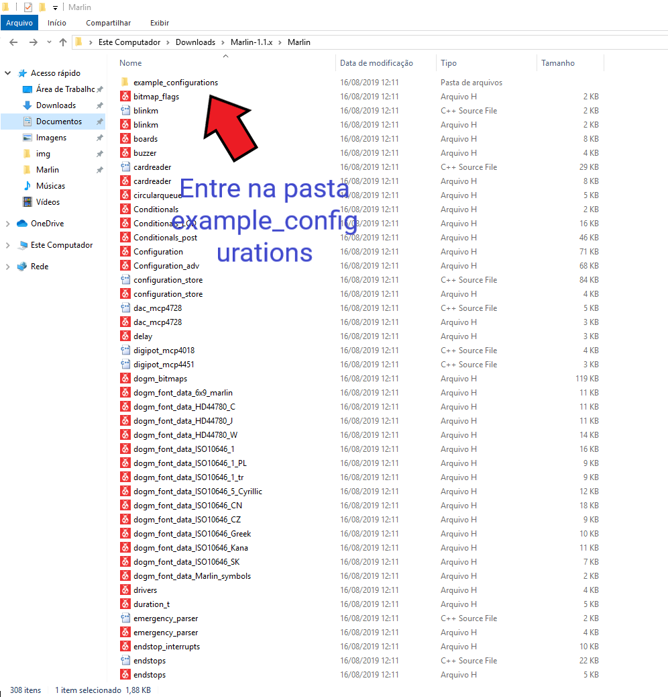
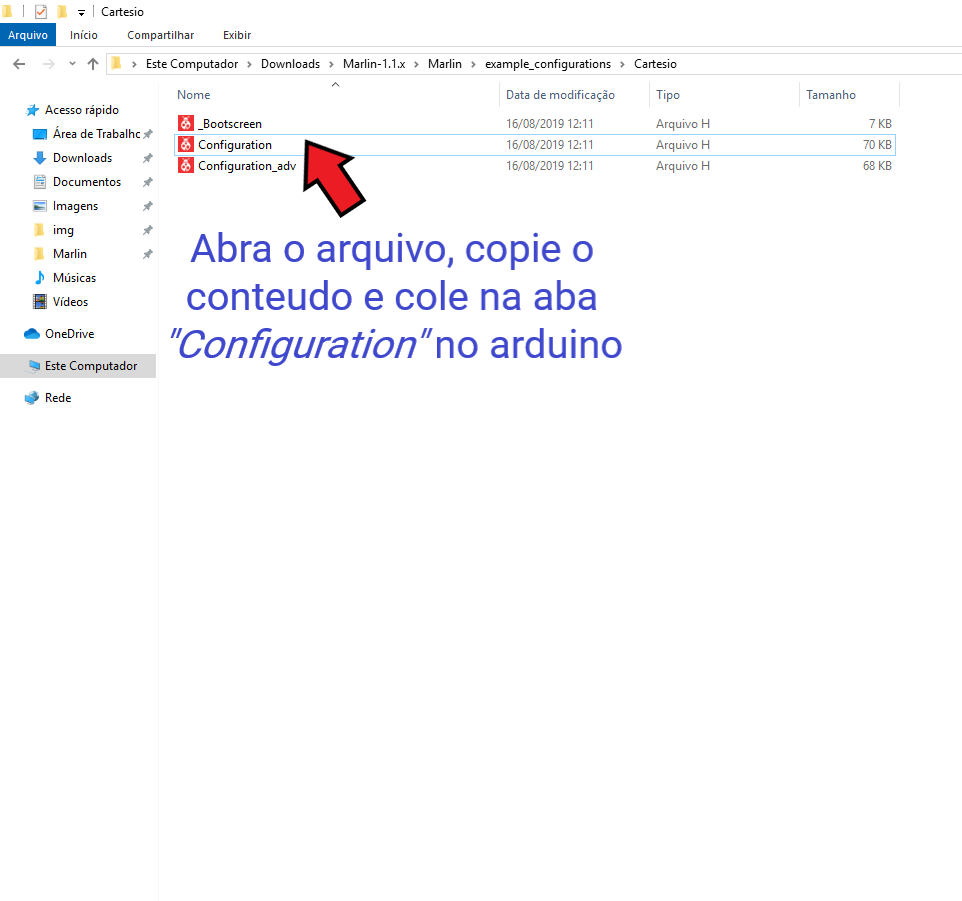
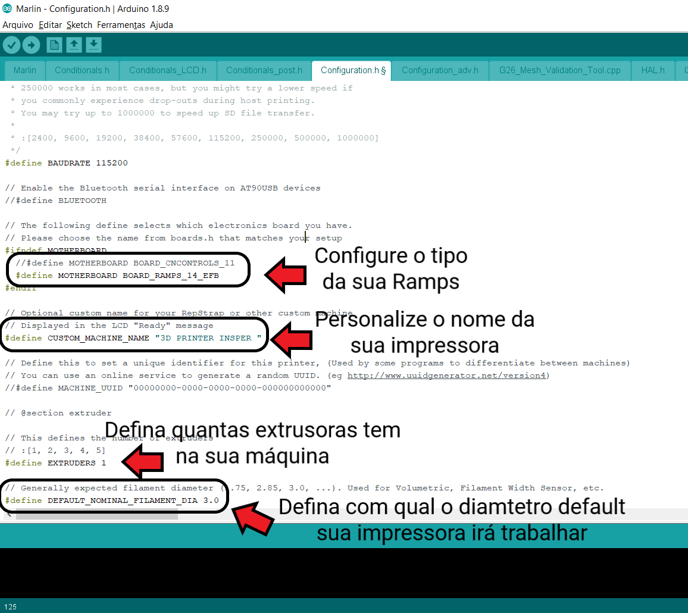
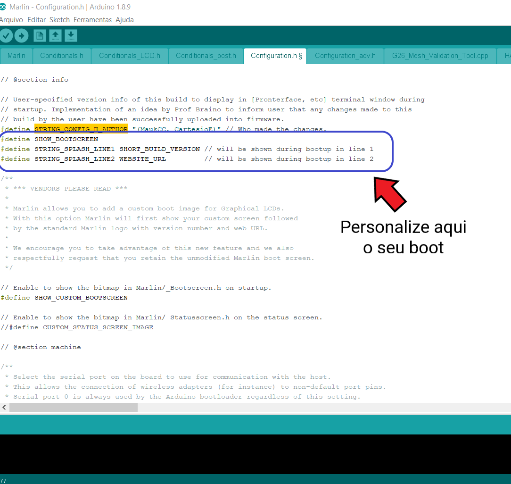
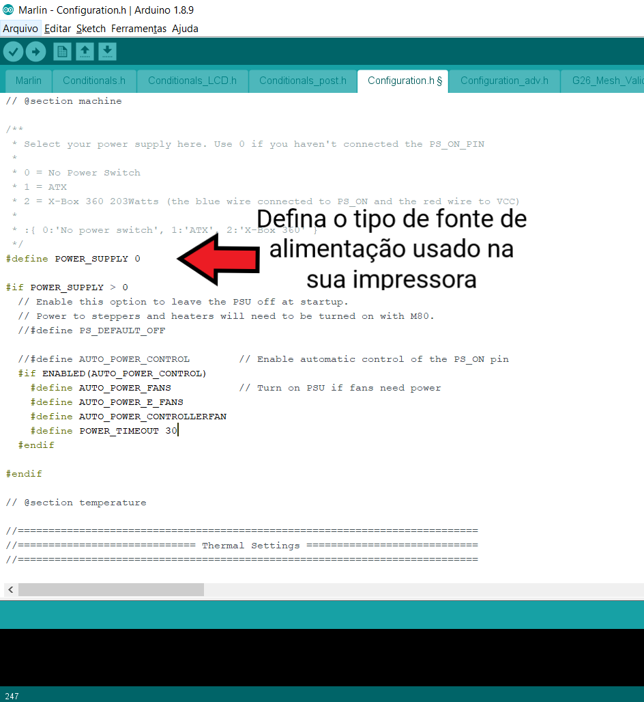
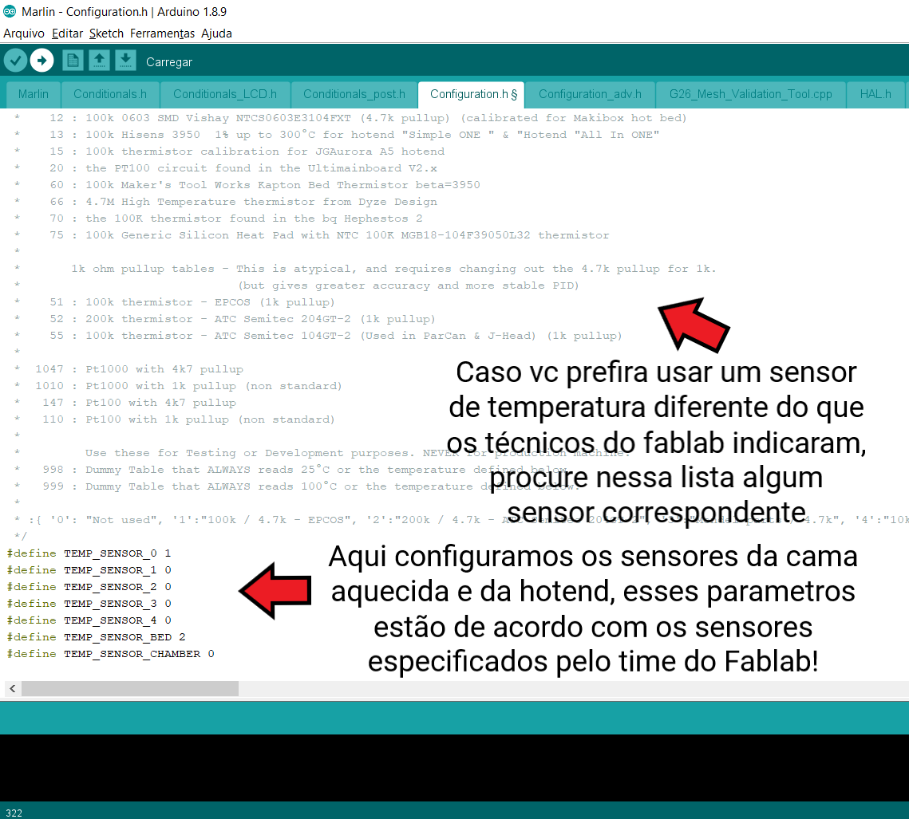

#  Como configurar o Marlin da sua impressora

Neste guia, faremos as configurações basicas no seu Marlin.

#  O que é preciso?

- Um computador com acesso a internet
- IDE do Arduino
- Arduino MEGA 

# Baixando o Marlin 

Clique neste [link](https://github.com/MarlinFirmware/Marlin) e faça o download da ultima versão do Marlin
 

Na pasta Marlin encontre o Marlin.ino
 

Agora vá ate a pasta example_configurations
 

Copie o conteudo do arquivo Configuration do template escolhido, e cole na aba *Configuration* do Marlin.io
 
 

# Vamos para Configuração do código

Procure por *This defines the number of extruders* na aba Configuration no seu Marlin.io
 

Você pode colocar uma mensagem personalizada no seu boot alterando esses parametros;

*STRING_CONFIG_H_AUTHOR* aparece na inicialização do Marlin e destina-se a identificar o autor do firmware. Use essa configuração como uma maneira exclusiva de identificar todas as suas configurações personalizadas. A mensagem de inicialização é impressa ao conectar ao software host e sempre que a placa é reinicializada.

*SHOW_BOOTSCREEN* ativa a tela de inicialização do LCD.

*STRING_SPLASH_LINE1 e STRING_SPLASH_LINE2* são exibidos na tela de inicialização.

 

Procure por *POWER_SUPPLY* na aba Configuration e defina que tipo de fonte de alimentação vc está usando na sua impressora
 

Agora vamos configurar o sensor de temperatura, procure por *Thermal Settings* na aba Configuration.h
Sensores de temperatura são componentes vitais em uma impressora 3D. Sensores rápidos e precisos garantem que a temperatura seja bem controlada, para manter o fluxo de filamento sem problemas e evitar acidentes. Use essas configurações para especificar os sensores de temperatura  da hotend e da cama aquecida.
 

## Tutorial baseado no guia oficial [Configuring Marlin](http://marlinfw.org/docs/configuration/configuration.html) 
